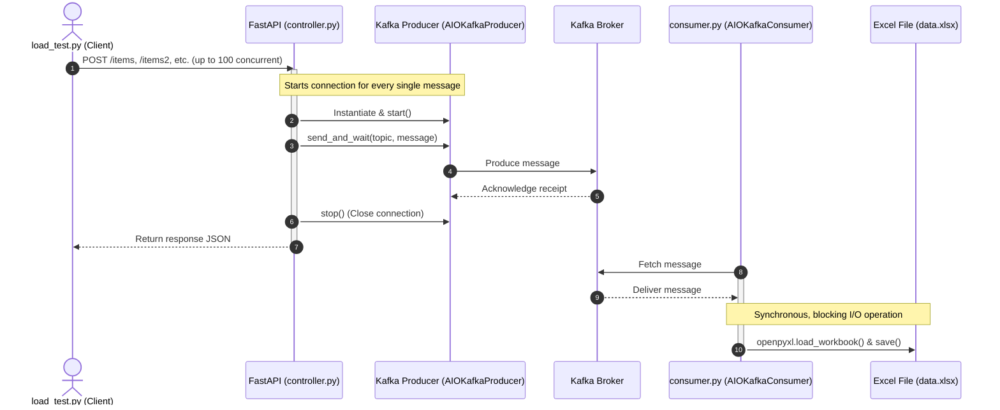

# Current Kafka & Load Test Implementation Analysis

This document describes the current logic of the FastAPI application, the load testing script, and the consumers, highlighting why the current implementation is not fully asynchronous, parallel, or optimized to push Kafka to its limits.

---

## 1. Flow Diagram of the Current Implementation



---

## 2. Component Breakdown

### A. Load Tester ([load_test.py](file:///c:/Users/abura/Development/kafka_project/load_test.py))
- **Action**: Uses `aiohttp` and `asyncio.gather` with a semaphore limit of `CONCURRENT_LIMIT = 100` to send 40 total requests (10 iterations $\times$ 4 endpoints).
- **Bottleneck**: The number of requests is very small (40 requests total), which executes in a fraction of a second and does not generate a sustained load to stress-test Kafka.

### B. FastAPI Controller ([controller.py](file:///c:/Users/abura/Development/kafka_project/controller.py))
- **Action**: Defines four endpoints (`/items`, `/items2`, `/items3`, `/items4`).
- **Bottleneck**: In `send_to_kafka`, a new `AIOKafkaProducer` is instantiated, started, and stopped for **every single request**:
  ```python
  async def send_to_kafka(topic: str, name: str):
      producer = AIOKafkaProducer(bootstrap_servers="localhost:9092")
      await producer.start() # Connection overhead!
      try:
          ...
          await producer.send_and_wait(topic, message) # Wait for confirmation
      finally:
          await producer.stop() # Disconnect overhead!
  ```
  This creates massive network latency overhead per request and negates the benefits of batching/pipelining in Kafka.

### C. Consumers ([consumer.py](file:///c:/Users/abura/Development/kafka_project/consumer.py), etc.)
- **Action**: Listens for messages on Kafka topics.
- **Bottleneck**: When a message is consumed, it writes to an Excel spreadsheet using `openpyxl` synchronously:
  ```python
  def save_to_excel(name: str):
      # Synchronous file system read/write
      wb = load_workbook(EXCEL_FILE) 
      ...
      wb.save(EXCEL_FILE)
  ```
  Because this code runs within `asyncio.run(consume())`, calling blocking synchronous code inside the main event loop blocks the entire process from fetching and processing next messages concurrently.

---

## 3. Recommended Roadmap for High-Performance Load Testing

1. **Persistent Producer**: Share a single `AIOKafkaProducer` instance across all FastAPI request lifecycles (started on app startup and stopped on shutdown).
2. **Asynchronous/Non-blocking Send**: Use `producer.send(...)` instead of `send_and_wait(...)` if immediate ACK is not required, allowing Kafka to buffer and batch requests.
3. **Optimized Load Generator**: Expand `load_test.py` to support high-volume concurrent workers generating continuous requests, or use a tool like Locust/Wrk.
4. **Avoid Sync I/O in Consumers**: Offload Excel writes to a thread pool (`asyncio.to_thread`) or use a database/in-memory queue to prevent blocking the event loop.
